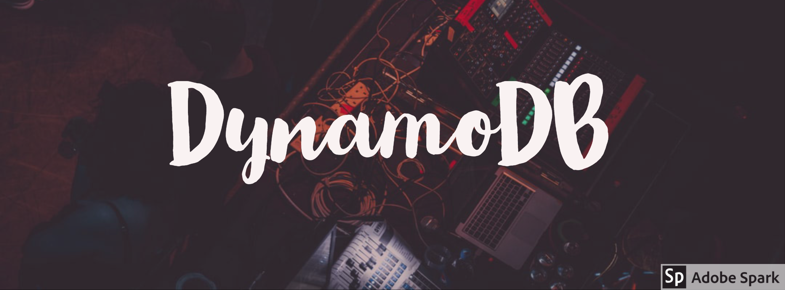

# DynamoDB-Python-Docker-Compose-Starter-Kit
A Docker and Docker Compose starter kit to help you get started with AWS DynamoDB quickly.

Use this as a boilerplate for your next project, I already did!

I am assuming you are already familiar with Docker and Docker Compose, so I'll get right to it. 

#### What is [DynamoDB](https://aws.amazon.com/dynamodb/)?
Amazon DynamoDB is a fully managed proprietary NoSQL database service that supports key-value and document data 
structures.

### What does the `app.py` do?

1. The `app.py` uses Facebook's Hydra Config Management to pickup the desired configuration, from the .yml file and 
loads it. 
2. Then a connection is made to a DynamoDB  Instance.
3. Some basic database operations are performed using the [PynamoDB](https://pynamodb.readthedocs.io/en/latest/) library. 

### How to run?

There are 2 modes in which you can run the `app.py` in.

### 1. Local DynamoDB Mode - 
Here, A Local Instance of DynamoDB is spun up using, Docker and Amazon's [Official Local DynamoDB Image](https://hub.docker.com/r/amazon/dynamodb-local/).
 
All the database operations are then performed on this local instance.

### 2. AWS DynamoDB Mode 
Here, the `app.py` will connect to the [AWS DynamoDB](https://aws.amazon.com/dynamodb/) Instance, this is how your code might run in the production.
In this mode you are expected to 
1. [Create a Python Virtual Environment](https://packaging.python.org/guides/installing-using-pip-and-virtual-environments/) 
2. `pip install -r requirements.txt`
3. Create an `.env` file with your AWS Credentials, like `example.env`.  
4. Replace *docker* with *aws* in the `env-config.yml`.
3. Run using `python app.py` 